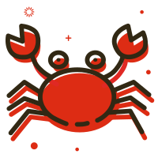

#  xCrab Agent

> Multi-model AI Gateway / 多模型 AI 网关 — A streamlined, fast, fully open-source framework / 精简版、快速高速的全开源型框架

## 🌟 Projects

### 🚀 [xCrab-Agent](https://github.com/yzp100911/xCrab-Agent) (v1.0.0)
Multi-model AI Gateway supporting MiniMax, DeepSeek and other mainstream LLM models.

### 🌐 [eClaw Server](https://github.com/yzp100911/eclaw-server) (v1.0.0)
Node.js + Express + WebSocket web server with user authentication and xCrab Gateway integration.

### 🤖 [Claw Client](https://github.com/yzp100911/claw-client) (v1.0.0)
AI assistant client running on Ubuntu server with Playwright browser automation.

## 🛠️ Tech Stack

## 📊 Latest Releases

| Project | Version | Date |
|---------|---------|------|
| [xCrab-Agent](https://github.com/yzp100911/xCrab-Agent/releases) | v1.0.0 | 2026-05-20 |
| [eClaw Server](https://github.com/yzp100911/eclaw-server/releases) | v1.0.0 | 2026-05-20 |
| [Claw Client](https://github.com/yzp100911/claw-client/releases) | v1.0.0 | 2026-05-20 |

## 📝 License

All projects are licensed under [GPL-3.0](https://github.com/yzp100911/xCrab-Agent/blob/main/LICENSE)

---

🦀 *Making AI Assistants Simpler / 让 AI 助手更简单*
